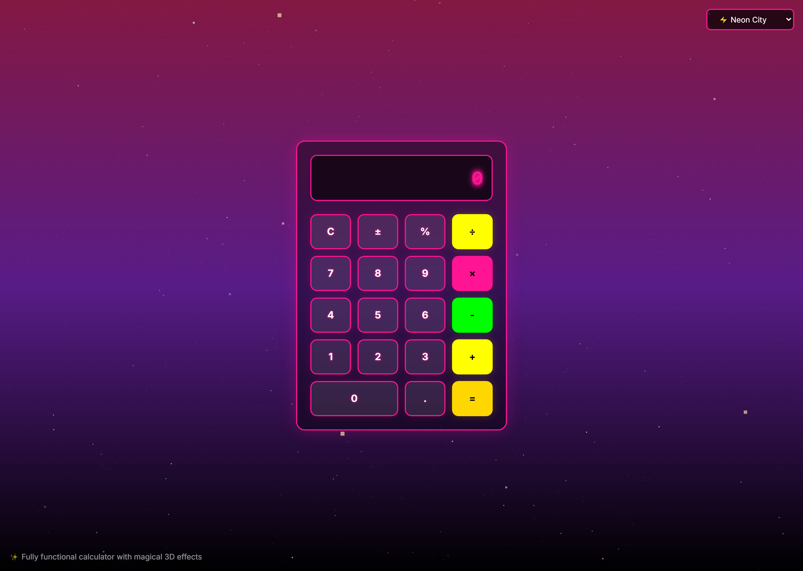

# 🌟 Holographic Calculator 3D

> **Experience mathematics like never before with stunning 3D holographic effects!**

A futuristic calculator featuring floating 3D elements, particle effects, and multiple immersive themes. Built with Next.js, React Three Fiber, and modern web technologies.

**🚀 [Live Demo](https://holographic-calculator-3d.vercel.app/)**



## ✨ Key Features

- 🔮 **3D Holographic Interface** - Floating calculator with stunning visual effects
- 🎨 **4 Unique Themes** - Holographic, Neon City, Cosmic, and Matrix
- 📱 **Fully Responsive** - Perfect on mobile, tablet, and desktop
- ⚡ **Real-time Calculations** - Instant results with visual feedback
- 🌌 **Dynamic Particles** - Background effects that respond to themes
- 📊 **3D History** - Calculation history as floating orbs
- 🎮 **Smooth Animations** - Interactive hover and transition effects

## 🚀 Getting Started

### Prerequisites
- Node.js 18+ 
- npm/yarn/pnpm

### Installation & Setup

```bash
# Clone the repository
git clone https://github.com/ahsankhizar5/holographic-calculator-3d.git
cd holographic-calculator-3d

# Install dependencies
npm install

# Start development server
npm run dev
```

**Open [http://localhost:3000](http://localhost:3000) to view the calculator**

## 🎯 How to Use

| Action | Method |
|--------|--------|
| **Calculate** | Click numbers and operators like any calculator |
| **Change Theme** | Use dropdown menu in top-right corner |
| **3D Controls** | Drag to rotate background (desktop only) |
| **View History** | Check the floating history panel |
| **Mobile** | Fully touch-optimized interface |

## 🛠️ Built With

| Technology | Purpose |
|------------|---------|
| **Next.js 14** | React framework with App Router |
| **React Three Fiber** | 3D graphics and animations |
| **Three.js** | WebGL 3D rendering |
| **TypeScript** | Type-safe development |
| **Tailwind CSS** | Utility-first styling |

## 🎨 Themes

| Theme | Style | Color Palette |
|-------|-------|---------------|
| 🌟 **Holographic** | Classic sci-fi aesthetic | Cyan & Electric Blue |
| ⚡ **Neon City** | Cyberpunk vibes | Hot Pink & Neon Green |
| 🌌 **Cosmic** | Deep space ambiance | Purple & Gold |
| 💚 **Matrix** | Retro terminal style | Matrix Green |

## 📱 Responsive Design

Optimized for all devices:
- **📱 Mobile** (< 640px): Touch-optimized compact layout
- **📟 Tablet** (640-1024px): Balanced interface 
- **🖥️ Desktop** (1024px+): Full 3D experience with all effects

## 📁 Project Structure

```
holographic-calculator-3d/
├── app/                 # Next.js App Router
├── components/          # React components
├── hooks/              # Custom hooks
├── lib/                # Utilities
├── public/             # Static assets
└── styles/             # Global styles
```

## 🚀 Scripts

```bash
npm run dev    # Development server
npm run build  # Production build
npm run start  # Production server
npm run lint   # Code linting
```

## 🌟 Roadmap

Future enhancements planned:
- [ ] 🔊 Sound effects and audio feedback
- [ ] ⌨️ Keyboard input support  
- [ ] 🔬 Scientific calculator mode
- [ ] 💾 Memory functions (M+, M-, MR, MC)
- [ ] 🎨 Custom theme creator
- [ ] 📱 PWA support for offline use
- [ ] 🎮 Haptic feedback and voice commands

## 🤝 Contributing

We welcome contributions! Here's how:

1. **Fork** the repository
2. **Create** a feature branch (`git checkout -b feature/amazing-feature`)
3. **Commit** your changes (`git commit -m 'Add amazing feature'`)
4. **Push** to branch (`git push origin feature/amazing-feature`)
5. **Open** a Pull Request

## 📄 License

This project is licensed under the **MIT License** - see [LICENSE](LICENSE) for details.

## 👨‍💻 Developer

**Ahsan Khizar**
- 🌐 GitHub: [@ahsankhizar5](https://github.com/ahsankhizar5)
- 💼 LinkedIn: [ahsankhizar](https://www.linkedin.com/in/ahsankhizar/)
- � Live Project: [holographic-calculator-3d.vercel.app](https://holographic-calculator-3d.vercel.app/)

---

<div align="center">

**✨ Experience the future of calculation today! ✨**

*Made with ❤️ by [Ahsan Khizar](https://github.com/ahsankhizar5)*

</div>
